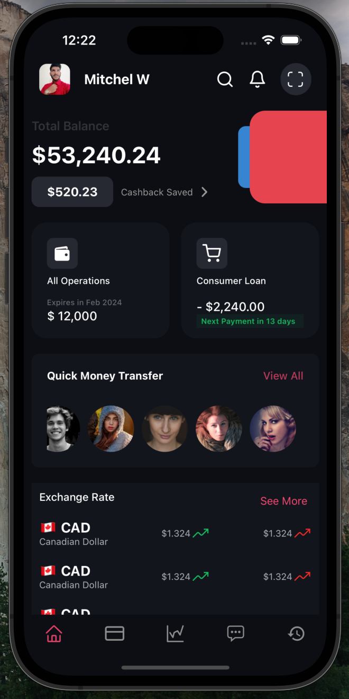

# FinManage - Your Personal Finance Assistant

Welcome to FinManage, your go-to finance app for managing cards, transactions, and keeping a close eye on your financial activities. We've just completed the HomeScreen, and there's a lot more exciting features in the pipeline to help you take control of your money.

## Preview



## Features

- **HomeScreen:**
  - Get an overview of your financial status at a glance.
  - Track your spending and income trends.
  - Quick access to key financial metrics.

- **Card Management:**
  - Add and manage your debit and credit cards.
  - Monitor card transactions and statements.

- **Transaction History:**
  - View detailed transaction history with categorization.
  - Easily search and filter transactions.

- **Expense Tracking:**
  - Categorize and analyze your expenses.
  - Set budgets and receive alerts for overspending.

- **Financial Insights:**
  - Smart insights on your spending patterns.
  - Visualizations to understand where your money is going.

- **Security:**
  - Secure login with biometric authentication.
  - End-to-end encryption for your financial data.

## Getting Started

1. Clone the repository:

   ```bash
   git clone https://github.com/your-username/finmanage.git
